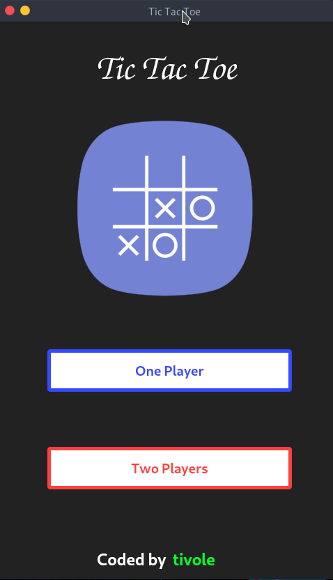
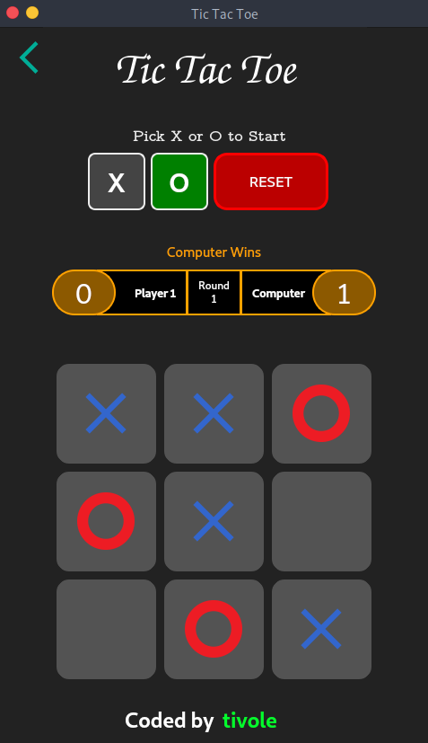
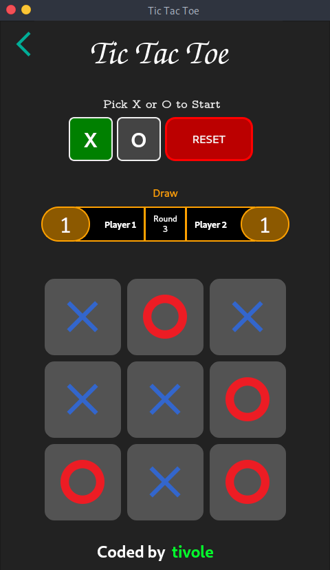
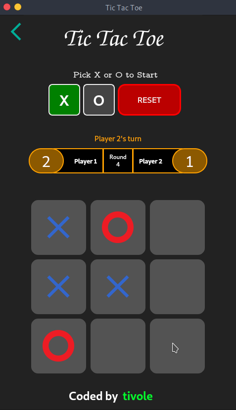

# Ti_TicTacToe
This is a <i>PyQt</i> based Tic Tac Toe game.

### Clone repository:
* Run `git clone https://github.com/tivole/Ti_TicTacToe.git` to clone repository.

### Make sure you have installed:
* <b><a href="https://www.python.org/">Python</a></b> (3.6 or above recommended)
* <b><a href="https://pypi.org/project/pip/">Pip</a></b> (18.1 or above recommended)
* <b><a href="https://pypi.org/project/PyQt5/">PyQt5</a></b> (5.13.0 or above recommended)

### Running Tic Tac Toe:
* Run `cd Ti_TicTacToe/src` to change directory.
* Run `python main.py` to run game.

## Screenshots

